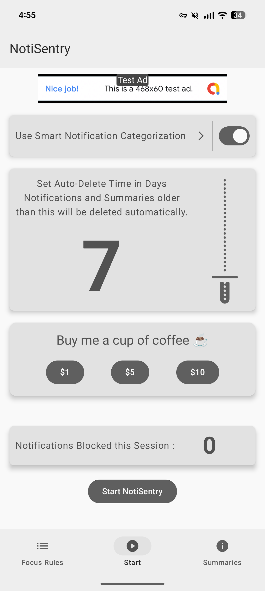
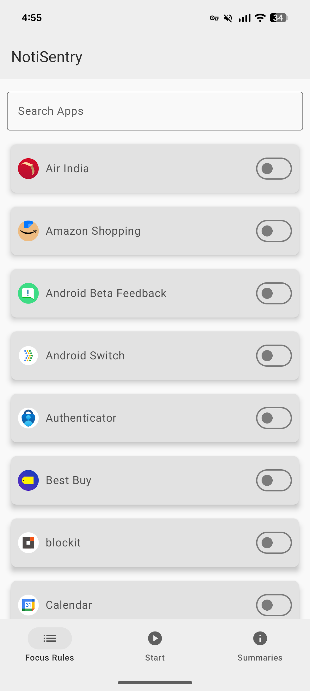
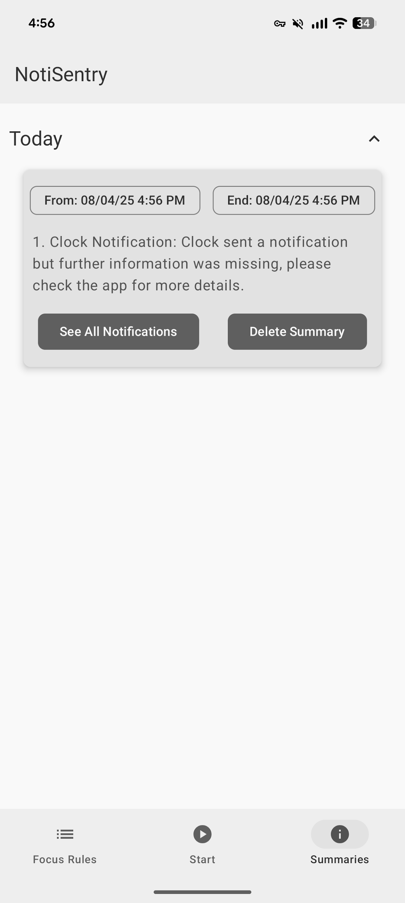
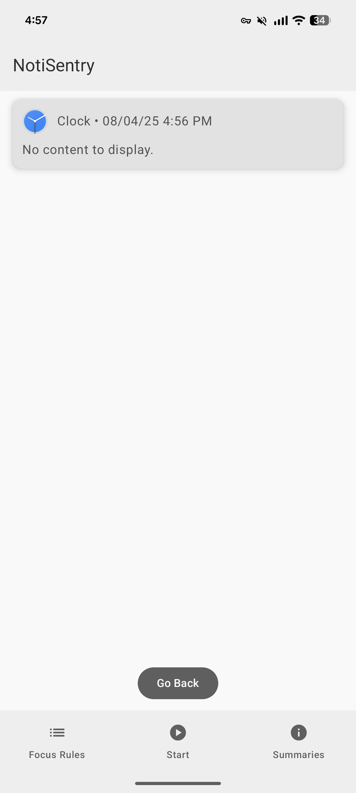
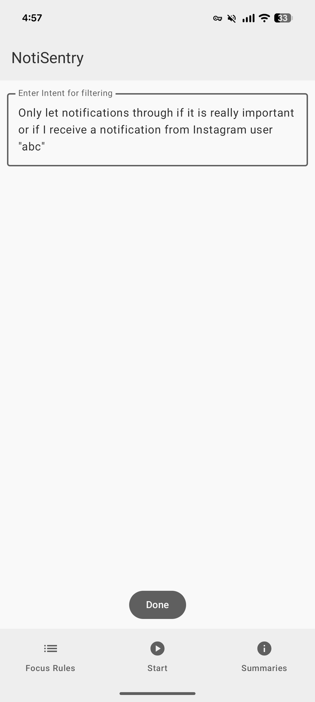

# NotiSentry

NotiSentry is a WIP modern Android application designed to help users reclaim their focus by intelligently managing, filtering, and summarizing notifications. Built with the latest Android technologies, this app provides a robust solution to notification overload. Below are the intended specifications for the app.

I originally planned to use Gemini Nano for its on-device capabilities, but due to the lack of a Pixel 9 series device for testing and to leverage the advantages of cloud infrastructure, I've opted for a more open and scalable solution with **Firebase** and **Gemini-Flash-2.5**. This allows for broader device support and enhanced capabilities.

PS: If you wish to try the app out, send me an email on : krosskinetic@gmail.com

---
## Images

<p align="center">
    
    
    
    
    
  </p>
---
## ✨ Features

* **Focus Mode**: A strict whitelisting system where users can select specific apps they want to receive notifications from. All other notifications are silently blocked and saved.
* **Intelligent Summarization**: Utilizes cloud-based AI (**Gemini-Flash-2.5** via **Firebase Functions**) to generate concise, bullet-pointed summaries of all blocked notifications.
* **Organized Summary View**: Blocked notification summaries are neatly categorized by day ("Today," "Yesterday," and "Archives") in an expandable list for easy viewing.
* **Persistent History**: All blocked notifications and generated summaries are saved persistently on the device using a Room database, and optionally synchronized with **Firebase Firestore** for cloud backup and multi-device access.
* **Modern, Clean UI**: Built entirely with Jetpack Compose and Material 3 Expressive design principles for a beautiful and intuitive user experience.
* **Scalable and Feature-Rich**: Leveraging cloud-based infrastructure offers several pros:
    * **Enhanced AI Capabilities**: Access to more powerful and up-to-date AI models like Gemini-Flash-2.5 without relying on device-specific hardware.
    * **Reduced On-Device Footprint**: Offloading heavy AI processing and data storage to the cloud can reduce the app's size and resource consumption on the user's device.
    * **Easier Updates and Maintenance**: AI model updates and bug fixes can be deployed to the cloud without requiring app updates.
    * **Analytics and Insights**: Firebase provides robust analytics tools to understand app usage and performance.

---
## 🏛️ Architecture

NotiSentry is built using a modern, scalable, and testable architecture based on Google's official recommendations, now extended to integrate with Firebase services. It follows a unidirectional data flow pattern, with the Repository acting as the single source of truth for all application data, potentially pulling from both local and cloud sources.
```
+----------------+      +------------------+      +------------------+      +---------+
|                |      |                  |      |                  |      |         |
|  Android OS    |----->| NotiSentryService|----->|   Application    |----->|  Room   |
| (Notifications)|      |    (Worker)      |      |   Repository     |      | Database|
|                |      |                  |      | (Source of Truth)|      | &       |
+----------------+      +------------------+      |                  |<-----|DataStore|
                                                  +--------^---------+      +---------+
                                                           |
                                                           | (Collects Flows)
                                                           |
                                                  +--------v----------+       + ------------------ +
                                                  |                   | ----> |       Firebase     |
                                                  |   AppViewModel    |       |  (Gemini-2.5-Flash)|
                                                  | (UI State Holder) | <-----|                    |
                                                  +--------^----------+       |                    |
                                                           |                  + -------------------+
                                                           | (Sends Events Up,
                                                           |  Receives State Down)
                                                           |
                                                  +--------v---------+
                                                  |                  |
                                                  |   Compose UI     |
                                                  |   (The Screen)   |
                                                  +------------------+

```
---
## 🛠️ Tech Stack & Key Libraries

* **UI**: 100% [Jetpack Compose](https://developer.android.com/jetpack/compose) with Material 3 components.
* **Architecture**: MVVM (Model-View-ViewModel) with a Repository pattern.
* **Asynchronicity**: [Kotlin Coroutines](https://kotlinlang.org/docs/coroutines-overview.html) and [Flow](https://kotlinlang.org/docs/flow.html) for managing background tasks and reactive data streams.
* **Dependency Injection**: [Hilt](https://dagger.dev/hilt/) for managing dependencies and creating a scalable, testable codebase.
* **Database**: [Room](https://developer.android.com/jetpack/androidx/releases/room) for persistent, on-device storage of notifications and summaries.
* **Cloud Database & Backend**: [Firebase Firestore](https://firebase.google.com/docs/firestore) for optional cloud synchronization of data.
* **Cloud Functions & AI**: [Firebase Functions](https://firebase.google.com/docs/functions) to host backend logic and integrate with **Gemini-Flash-2.5** for intelligent summarization.
* **Navigation**: [Jetpack Navigation Compose](https://developer.android.com/jetpack/compose/navigation) for navigating between screens.
* **Settings**: [Jetpack DataStore](https://developer.android.com/jetpack/androidx/releases/datastore) for persistently storing simple user preferences.
* **Background Service**: `NotificationListenerService` to capture system-wide notifications.

---
## 🚀 Setup & Configuration

1.  **Clone the repository.**
2.  **Open in Android Studio.**
3.  **Set up Firebase Project:**
    * Create a new Firebase project in the [Firebase Console](https://console.firebase.google.com/).
    * Add an Android app to your Firebase project and follow the instructions to download `google-services.json` and place it in your app module directory.
    * Enable **Firestore** and **Cloud Functions** in your Firebase project.
    * Configure Firebase Functions with the necessary API keys for Gemini-Flash-2.5.
4.  **Build the project:** Gradle will automatically download and sync all the necessary dependencies.
5.  **Run the app:** On an emulator or physical device.
6.  **Grant Permission:** On first launch, the app will guide you to the system settings to grant "Notification Access," which is required for the core functionality.
